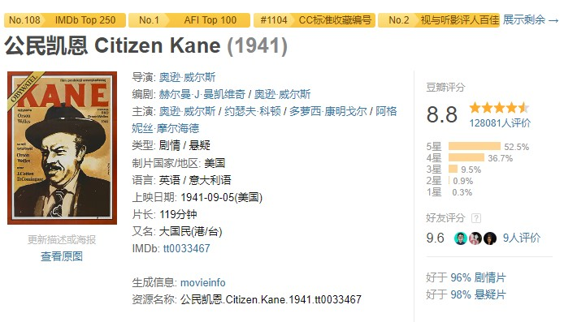
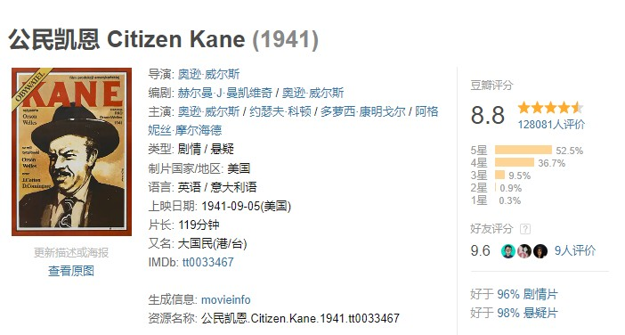
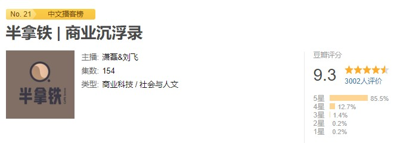
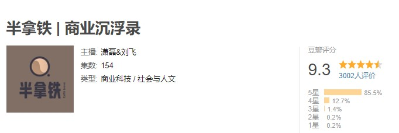

# 豆瓣榜单助手·Douban-Ranker

📊 为你的豆瓣电影和播客自动生成**多榜单排名**。

## 安装

需要浏览器装有 [Tampermonkey](https://tampermonkey.net/) 或 [Violentmonkey](https://violentmonkey.github.io/) 插件。

| eddiehe.top 源 | GitHub 源 | GreasyFork 源 |
| --- | --- | --- |
| [安装（推荐）](https://douban-ranker.eddiehe.top/douban-ranker.user.js) | [安装](https://raw.githubusercontent.com/eddiehe99/douban-ranker/refs/heads/main/douban-ranker.user.js) | [安装](https://update.greasyfork.org/scripts/536994/%E8%B1%86%E7%93%A3%E6%A6%9C%E5%8D%95%E5%8A%A9%E6%89%8B%C2%B7Douban-Ranker.user.js) |

## 功能

- 在豆瓣电影页面中，聚合 AFI/CC/TSPDT 等电影榜单
- 在豆瓣播客页面中，展示 [中文播客榜](https://xyzrank.com/#/) 排名
- 在豆瓣音乐页面中，展示 [HMA（HOPICO MUSIC AWARD）](https://space.bilibili.com/261485584/lists/3748867?type=series) 信息

### 豆瓣电影页面功能展示

- 开启脚本：

    

- 关闭脚本：

    

### 豆瓣播客页面功能展示

- 开启脚本：

    

- 关闭脚本：

    

## 参考

- [豆瓣资源下载大师](https://greasyfork.org/scripts/329484)
- [Bilibili-Evolved](https://github.com/the1812/Bilibili-Evolved)

## 数据来源

- [rank4donban](https://github.com/eddiehe99/rank4douban)
- [xyzrank](https://github.com/eddiehe99/xyzrank)

## 贡献者

## Acknowledgement（感谢）

本项目构建过程中，借助了 [紫东太初](https://taichu-web.ia.ac.cn/#/chat)、[商量](https://chat.sensetime.com/)、[通义](https://www.tongyi.com/)、[腾讯元宝](https://yuanbao.tencent.com/)、[DeepSeek](https://chat.deepseek.com/)、[Kimi](https://kimi.moonshot.cn)、[豆包](www.doubao.com) 等 LLM 的帮助。

## PS

- 项目开源 GitHub 仓库地址：[eddiehe99/douban-ranker](https://github.com/eddiehe99/douban-ranker)

- 脚本 GreasyFork 页面：[豆瓣榜单助手·Douban-Ranker](https://greasyfork.org/en/scripts/536994-%E8%B1%86%E7%93%A3%E6%A6%9C%E5%8D%95%E5%8A%A9%E6%89%8B-douban-ranker)
